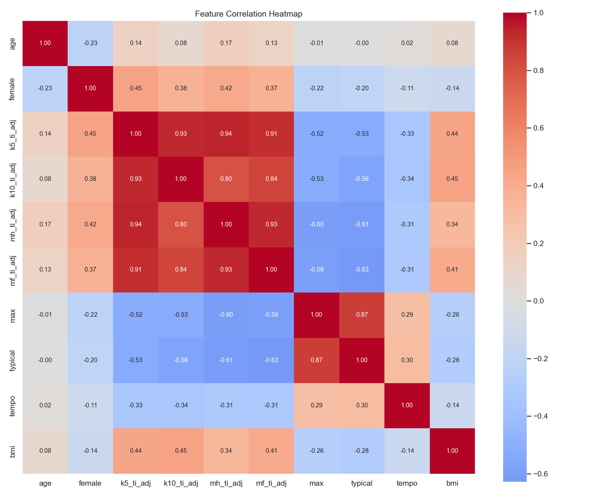
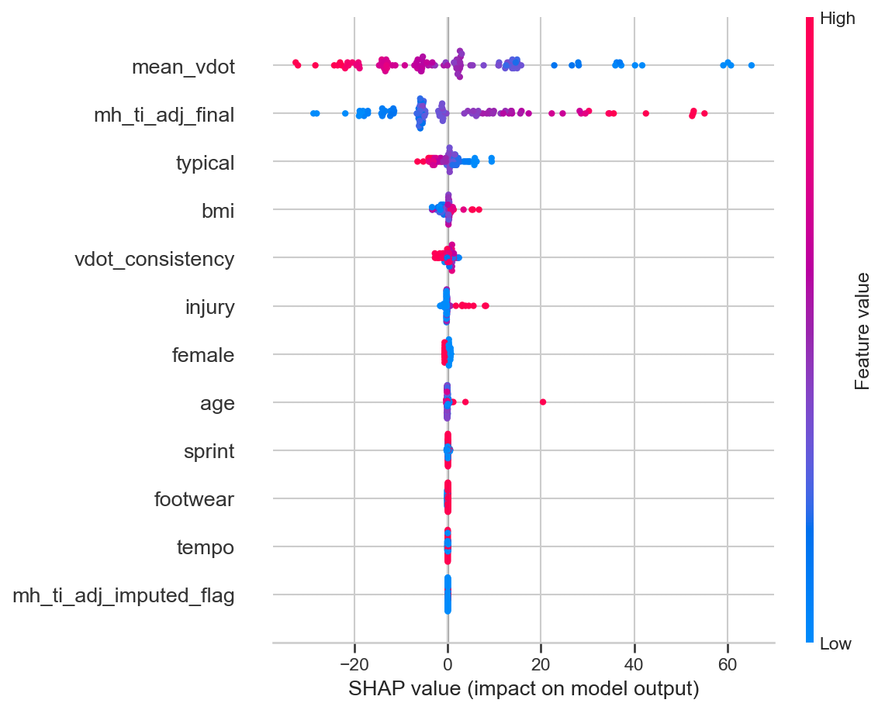
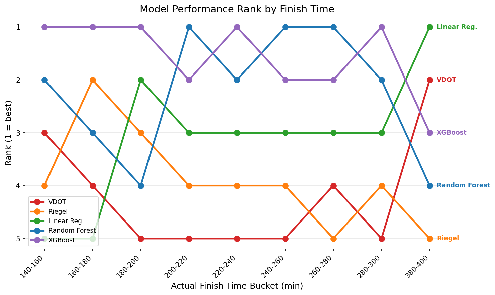
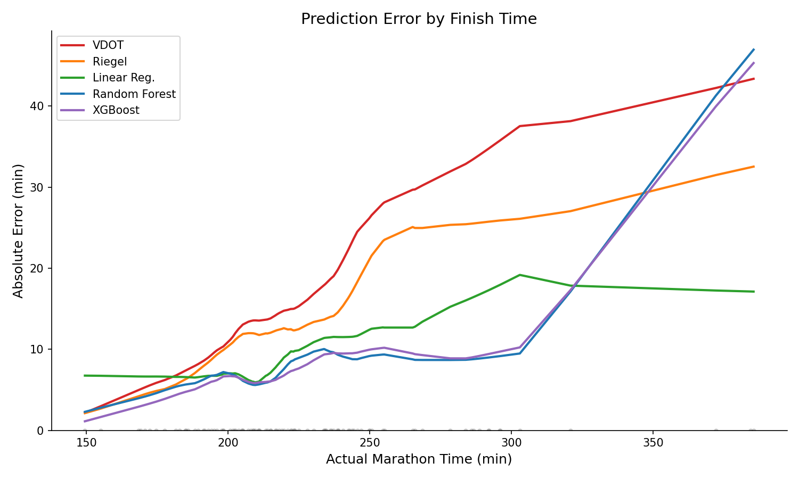

# A Better Marathon Predictor

I built a marathon-time predictor using some standard data-science and ML tools that outperforms typical methods.

## Abstract

I have run a couple marathons, and each time it was really hard to target a pace. This is a problem lots of marathon runners have. To solve this problem, I built a marathon finish time predictor. I used and cleaned public data from prior research projects to engineer features for a ML model which beats traditional pace predictors. More specifically, I adapted a dataset from a study by Vickers et al. that included training and demographic data along with marathon time. From this adapted dataset (n=487), and using my domain knowledge from working as a personal trainer and running marathons myself I engineered useful features for a model. I then followed standard practices to train a model that beats benchmarks, specifically the Riegel and VDOT prediction methods. My best model (gradient-boosting) boasts a 40.7% reduction on MAE from 16.64 minutes to 9.86 minutes, and 5+ minute reduction in RMSE when benchmarked on my test set. This model did suffer from being restricted to a small dataset, and predicted times above 4 hours poorly, along with suffering from overfitting to faster runners. Moving forward, I could annotate a larger training set with imputed or matched marathon times for better training, and/or I could create a web service for people to utilize this predictor for themselves.

## Introduction

January of 2025, I was stressed because I had a marathon coming up in a week and I wasn’t sure what pace to aim for. Even after plenty of training runs and looking at predictors online, I wasn’t confident in what I was seeing.

That wasn’t just a problem for me. Generally, it's hard to predict your own marathon time because pacing exercises carry a huge fatigue cost, more metabolic systems are tested at marathon distance than shorter races, and the wider range of possible finish times increases error penalty.

It occurred to me recently that data/ML is a good fit for solving this issue; There is ample marathon training and finish time data available, and there are a large number of factors contributing to runner’s times in a non-linear fashion.

This project utilized marathon training and finish time data to create an ML model that is more accurate than the predictors I used when I ran my marathon.


## Datasets and Sourcing

### Vickers and Vertosick Data

This dataset contains training data on 2,303 runners, including but not limited to typical weekly mileage, age, sex, bmi, and either 1 or 2 recent races with finish times. I adapted this dataset to train my model.

- Paper: https://link.springer.com/article/10.1186/s13102-016-0052-y
- Data: https://springernature.figshare.com/articles/dataset/Additional_file_2_of_An_empirical_study_of_race_times_in_recreational_endurance_runners/4442066

### Afonseca et al. Data

This dataset contains training data on 36,412 runners who ran a world major marathon over the course of two years (2019, 2020), including training mileage per week across measurement period, age, sex, nationality, and name of marathon run. I didn’t use this dataset as it doesn’t have a marathon finish time to train on, but I could train on it in the future.

- Paper: https://peerj.com/articles/13192/
- Data: https://figshare.com/articles/dataset/A_public_dataset_on_long-distance_running_training_in_2019_and_2020/16620238

## Methodology

I followed established data/ML workflows and methodology for this project. I came up with a problem statement, sourced data and did EDA, engineered features for my models, trained and benchmarked models, and then evaluated results and limitations. Each step in the workflow was done in an annotated Jupyter notebook. File structure below.

```
.
├── data/
│   ├── external/
│   ├── processed/
│   │   ├── personal_features.csv
│   │   ├── personal_features.parquet
│   │   ├── test.parquet
│   │   ├── train.parquet
│   │   └── ...
│   ├── raw/
│   │   ├── afonseca/
│   │   ├── bm_archive/
│   │   ├── personal_strava_data/
│   │   └── vickers_dataset.xlsx
│   └── READ_ME.md
├── models/
│   ├── gradient_boosting_tuned.pkl
│   ├── linear_regression.pkl
│   ├── random_forest_tuned.pkl
│   └── ...
├── notebooks/
│   ├── 01_data_exploration.ipynb
│   ├── 02_feature_engineering.ipynb
│   ├── 03_model_training.ipynb
│   └── 04_evaluation.ipynb
├── results/
│   ├── figures/
│   │   ├── correlation_heatmap.png
│   │   ├── mae_by_finish_time.png
│   │   ├── shap_summary.png
│   │   ├── predicted_vs_actual.png
│   │   └── ... (19 more)
│   └── tables/
│       └── prediction_metrics.pkl
├── src/
│   ├── baselines.py
│   ├── data_loading.py
│   ├── evaluate.py
│   ├── features.py
│   └── ... (5 more)
├── tests/
│   └── test_baselines.py
├── environment.yml
├── pyproject.toml
└── README.md
```


## Approach

I sourced the data by looking at old ML-based marathon predictors I used and searching for where they found their data, looking at marathon datasets on Kaggle, and prompting Claude to comb through marathon research. After finding the Vickers et al. dataset and the Afonseca dataset, I loaded and profiled each dataset in that respective order. The Vickers dataset looked clean and usable after profiling, and after EDA I concluded that, while n was small, the dataset was rich enough to train a decent model. The Afonseca et al. data was richer and n was large, but there was no marathon time to test off of, so I decided to move forward with the Vickers dataset. Full EDA is annotated in `notebooks/01_data_exploration.ipynb`.



Based on what I learned in EDA and my domain knowledge, I engineered two features based on established VO2-max estimators and comparing endurance ratios. I decided to impute half-marathon times for the 22% of our dataset that didn't have times, and then dropped columns that had low predictive value or were highly correlated with other features I was already using. I considered PCA, but I wanted to maintain interpretability in my results. I decided to drop all race times but one, and kept all other datapoints. I then split my data into a test and training set. Details in `notebooks/02_feature_engineering.ipynb`.

I started modeling with a simple linear regression as a quick sanity check to make sure that my data was good enough. If LR didn't beat Riegel and VDOT baselines, that would mean my features/data weren't strong enough. Thankfully it did. Given my knowledge of what makes a good runner and how that's measured, I understood that there was a non-linear relationship between the features we had and the times runners run, so I moved on to a Random Forest model. RF offered some good improvements over linear regression, but not by as much as I thought it would. I figured I could squeeze out a little more performance with gradient boosting, so I used an XGBoost model and tuned estimators, learning rate, and tree depth using cross validation. It got us under 10 MAE, which was a goal of mine.

| Model | MAE (min) | RMSE (min) | MAPE (%) | R² |
|-------|-----------|------------|----------|------|
| Riegel baseline | 15.53 | 20.89 | 6.53 | 0.78 |
| VDOT baseline | 16.18 | 21.70 | 6.75 | 0.77 |
| Linear Regression | 11.04 | 14.81 | 4.62 | 0.89 |
| Random Forest (Tuned) | 10.10 | 14.46 | 4.16 | 0.89 |
| Gradient Boosting (Tuned) | 9.86 | 14.07 | 4.02 | 0.89 |

The most impactful variables to the model were previous race time and a VO2-max estimator. Marathon time scales more or less linearly with these variables. The other values have less of a linear relationship with marathon time, and I figured GB would capture their influence best. It seems like in the end I overestimated their importance vs. linear predictors, which is why our tree-based models didn't improve so much over linear regression. Training details are in `notebooks/03_model_training.ipynb`.



To evaluate my model, I produced a number of charts, plots, and graphs to help me assess overfitting, performance, and find any other quirks or bugs. The model works well for sub-4-hour runners but degrades significantly after that, likely because our data skews toward higher-performance runners and thins out past the 4-hour mark.

| Tier | MAE | Median AE | N |
|------|-----|-----------|---|
| Sub-3 | 2.99 | 1.81 | 8 |
| 3-4 hrs | 7.04 | 6.33 | 60 |
| 4-5 hrs | 15.48 | 11.17 | 24 |
| 5+ hrs | 27.60 | 19.39 | 5 |



Full evaluation with residual plots, SHAP dependence plots, and tier breakdowns is in `notebooks/04_evaluation.ipynb`.


## Key Results

Our gradient boosted model improved on the Riegel baseline MAE by 40.7% bringing it below 10 minutes, making it a viable predictor by my own standards. The most impactful features we analyzed were mean VDOT and half marathon time by runner. Our model is quite accurate for runners with times predicted 4:00 and below.

| Model | MAE (min) | RMSE (min) | MAPE (%) | R² |
|-------|-----------|------------|----------|------|
| Riegel baseline | 15.53 | 20.89 | 6.53 | 0.78 |
| VDOT baseline | 16.18 | 21.70 | 6.75 | 0.77 |
| Linear Regression | 11.04 | 14.81 | 4.62 | 0.89 |
| Random Forest (Tuned) | 10.10 | 14.46 | 4.16 | 0.89 |
| Gradient Boosting (Tuned) | 9.86 | 14.07 | 4.02 | 0.89 |



## Limitations and Next Steps

### Known limitations


- **Self-reported data:** Vickers dataset is survey-based with no independent verification of race times or training volumes.
- **Small dataset:** ~487 usable runners limits the model's ability to learn complex patterns and generalize.
- **Selection bias:** Survey respondents are more engaged, experienced runners, so the model may not generalize to casual first-time marathoners.
- **Missing half marathon data:** ~22% of half marathon times were imputed via Riegel formula, introducing a fixed-formula assumption into a portion of the training data.
- **Bias towards faster population of runners** Our useable dataset biased towards the faster end of marathoners, so our model predicts worse for slower marathoners.


### Next Steps
- **Link to Afonseca training logs:** I could use probabilistic matching to match runners in the Afonseca dataset with their actual marathon results. That would allow me to train on a dataset 100x the size, which would no doubt boost performance (as well as create novel, useful data).
- **Build Webapp that hooks up to Strava API** I can build a basic front and backend, along with an auth setup to connect to people's Strava APIs and serve them accurate predictions. That would actually be useful to people.
- **Use Bayesian or sequence modeling over training trajectories** The Afonseca dataset has training stats per week, so I would be able to model on the order and shape of training over time. These are useful techniques and would serve as a good learning opportunity for me.
- **Conformal prediction or quantile regression for uncertainty quantification** This is also something I could do with the Afonseca dataset because of its size. Right now I return something saying "Your marathon will be X". It would be more informative to racers if I could give them a range and a confidence measure.


## How to Reproduce
```bash
# Clone the repo
git clone git@github.com:jacmil/Marathon-Pace-Predictor.git
cd Marathon-Pace-Predictor

# Create and activate the conda environment
conda env create -f environment.yml
conda activate marathon

# Install the project package
pip install -e .

# Run notebooks in order
# Open in VS Code or Jupyter and execute 01 through 04
```

Data is included in the repo (Afonseca files via Git LFS). If LFS files don't download automatically, run `git lfs pull`.

## References

- Vickers, A.J., Vertosick, E.A. (2016). An empirical study of race times in recreational endurance runners. *BMC Sports Science, Medicine and Rehabilitation*, 8(26). [Paper](https://bmcsportsscimedrehabil.biomedcentral.com/articles/10.1186/s13102-016-0052-y) | [Data](https://springernature.figshare.com/articles/dataset/Additional_file_2_of_An_empirical_study_of_race_times_in_recreational_endurance_runners/4442066)
- Afonseca, V., Watanabe, R., Duarte, M. (2022). A public dataset on long-distance running training in 2019 and 2020. *PeerJ*, 10:e13192. [Paper](https://peerj.com/articles/13192/) | [Data](https://figshare.com/articles/dataset/A_public_dataset_on_long-distance_running_training_in_2019_and_2020/16620238)
- Smyth, B., Lawlor, A. Research on marathon prediction using Strava data, Insight Centre for Data Analytics, UCD. [Running with Data blog](https://medium.com/running-with-data)
- Riegel, P.S. (1981). Athletic Records and Human Endurance. *American Scientist*, 69(3), 285-290.
- Daniels, J. (2013). *Daniels' Running Formula* (3rd ed.). Human Kinetics.

